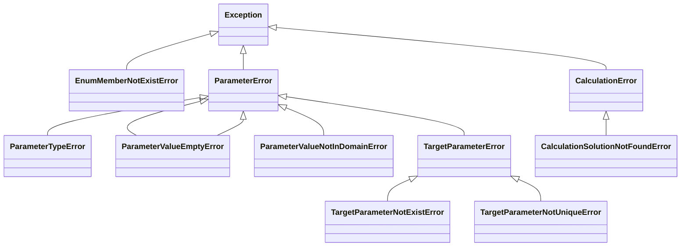

# Exception

## 继承关系图

## EnumMemberNotExistError

枚举成员不存在

### Attributes

- enum (_Enum_) : 枚举类
- value (_str_) : 枚举成员的字符串表示
- message (_str_) : 异常信息

## ParameterError

参数错误

### Attributes

- message (_str_) : 异常信息

## ParameterTypeError

参数类型错误

### Attributes

- message (_str_) : 异常信息

## ParameterValueNotInDomainError

参数值不在定义域内

### Attributes

- message (_str_) : 异常信息

## ParameterValueEmptyError

参数值为空

### Attributes

- message (_str_) : 异常信息

## TargetParameterError

目标参数错误

### Attributes

- message (_str_) : 异常信息

## TargetParameterNotExistError

目标参数不存在

### Attributes

- message (_str_) : 异常信息

## TargetParameterNotUniqueError

目标参数不唯一

### Attributes

- message (_str_) : 异常信息

## CalculationError

计算错误

### Attributes

- message (_str_) : 异常信息

## CalculationSolutionNotFoundError

计算无解

### Attributes

- message (_str_) : 异常信息
